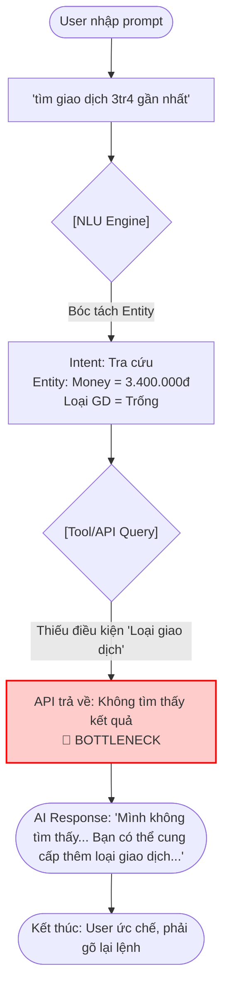
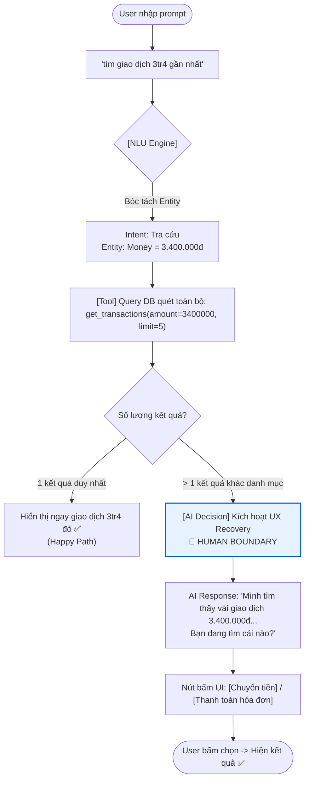

# Workshop — Mổ App AI Thật: Trợ lý Moni (MoMo)

**Thời gian:** 35-45 phút  
**Hình thức:** cá nhân  
**Người thực hiện:** (Học viên điền tên)
**Sản phẩm:** MoMo — Trợ thủ tài chính Moni

---

## 1. Dùng thử: promise vs reality

- **Product hứa gì?** Moni đóng vai trò là một "trợ thủ tài chính cá nhân" AI, giúp người dùng tra cứu nhanh, quản lý chi tiêu và giải đáp thắc mắc về các giao dịch trên MoMo thông qua chat.
- **User nào được hứa sẽ được giúp?** Người dùng MoMo thường xuyên có nhu cầu tra cứu lại lịch sử giao dịch (mua sắm, chuyển tiền, ăn uống, v.v.) mà không muốn lướt tìm thủ công.
- **Kỳ vọng AI làm được task nào?** Có khả năng hiểu ngôn ngữ tự nhiên (NLU) linh hoạt khi người dùng NÓI về giao dịch của họ, tự động nhận diện ý định tra cứu (intent) dựa trên các tham số cơ bản như số tiền, thời gian.
- **Thực tế - Điểm gãy xuất hiện ở đâu?** 
  - **Prompt thử nghiệm:** *"tìm giao dịch 3tr4 gần nhất"*
  - **Hành vi quan sát được:** Mặc dù câu hỏi rất rõ ràng về ý định và số tiền cụ thể ("3tr4" được bot hiểu đúng là "3.400.000đ"), bot lại báo **không tìm thấy giao dịch nào** và yêu cầu cung cấp thêm *"ngày giao dịch, loại giao dịch"*. Thực tế, nếu cung cấp rõ loại giao dịch (VD: chuyển khoản) thì bot mới tìm được.
  - **Evidence:** Mặc dù AI phân tích Entity rất tốt (nhận diện được số tiền), nhưng Logic truy vấn DB lại bị gãy cứng nhắc (fallback to failure) vì dường như hệ thống đòi hỏi phải có Category keyword (loại giao dịch) mới chịu tìm kiếm hiệu quả.
  

## 2. Vẽ 4 paths (Phân tích thiết kế của Moni)

| Path | Nhận xét hiện tại của Moni |
|---|---|
| **Happy** | User nhập đúng "tìm giao dịch chuyển khoản 3.400.000đ" -> AI parse đủ danh mục + số tiền -> Gọi API tra cứu -> Show kết quả. |
| **Low-confidence** | **(ĐIỂM YẾU HỆ THỐNG)** Khi user nhập "tìm giao dịch 3tr4 gần nhất", AI đã bóc tách được số tiền nhưng hệ thống tra cứu lại trả về rỗng vì thiếu "loại giao dịch". Thay vì thiết kế luồng hỏi lại tự động bằng nút bấm (Clarification bằng UI) hoặc quét mở rộng, AI bắt user phải tự gõ lại toàn bộ thông tin. |
| **Failure** | AI báo lỗi "Mình không tìm thấy...". User cảm thấy ức chế vì "3tr4" là một dữ liệu rất lớn và cụ thể, rất dễ tìm bằng mắt nhưng AI lại không tự quét ra được. Cách sửa là user tự phải đoán và đổi prompt thêm keyword "chuyển tiền". |
| **Correction** | User tự sửa prompt. AI phản hồi đúng, nhưng hệ thống không ghi nhận thói quen tra cứu này cho lần sau. |

## 3. Viết finding thành quyết định

```text
Khi user [nhập lệnh tìm kiếm giao dịch kèm số tiền rất cụ thể nhưng thiếu loại giao dịch (ví dụ: "tìm giao dịch 3tr4 gần nhất")],
AI/product [đã nhận diện đúng số tiền (3.400.000đ) nhưng API tra cứu thất bại và từ chối trả kết quả],
hậu quả là [user thất vọng vì bot tỏ ra hiểu ngữ cảnh nhưng lại vô dụng trong việc tìm kiếm thực tế, bắt user tự thay đổi cách hỏi].
Lỗi thuộc layer [Data-tool (API cứng nhắc) / UX Recovery].
Nên sửa bằng [Cải thiện hàm Tool + Clarification UX]. Cụ thể: 
1. Cải tiến Tool/API: Cho phép API `get_transactions` quét mở rộng toàn bộ danh mục chỉ dựa trên input là số tiền `3.400.000đ` (bỏ điều kiện ràng buộc bắt buộc về loại giao dịch).
2. UX Recovery: Nếu database trả về nhiều kết quả 3tr4 thuộc các loại khác nhau -> AI kích hoạt UX Clarification với các nút bấm để user chọn (VD: Chuyển tiền / Thanh toán).
```

## 4. Sketch as-is / to-be

### AS-IS (Luồng hiện tại)



### TO-BE (Luồng đề xuất sửa chữa)


