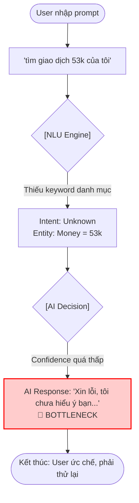
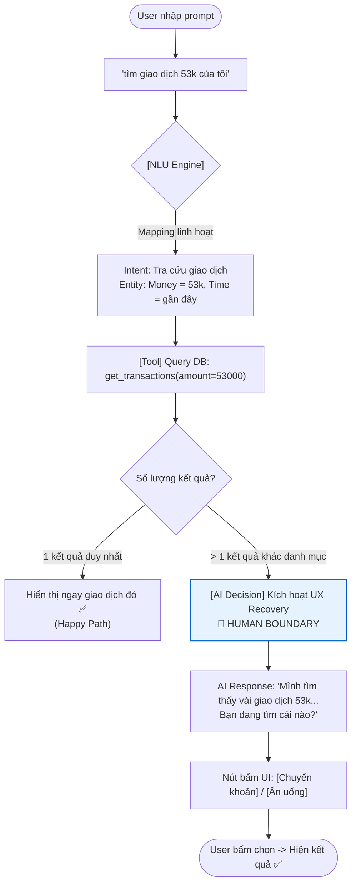

# Workshop — Mổ App AI Thật: Trợ lý Moni (MoMo)

**Thời gian:** 35-45 phút  
**Hình thức:** cá nhân  
**Người thực hiện:** (Học viên điền tên)
**Sản phẩm:** MoMo — Trợ thủ tài chính Moni

---

## 1. Dùng thử: promise vs reality

- **Product hứa gì?** Moni đóng vai trò là một "trợ thủ tài chính cá nhân" AI, giúp người dùng tra cứu nhanh, quản lý chi tiêu và giải đáp thắc mắc về các giao dịch trên MoMo thông qua chat.
- **User nào được hứa sẽ được giúp?** Người dùng MoMo thường xuyên có nhu cầu tra cứu lại lịch sử giao dịch (mua sắm, chuyển tiền, ăn uống, v.v.) mà không muốn lướt tìm thủ công.
- **Kỳ vọng AI làm được task nào?** Có khả năng hiểu ngôn ngữ tự nhiên (NLU) linh hoạt khi người dùng NÓI về giao dịch của họ, tự động nhận diện ý định tra cứu (intent) dựa trên các tham số cơ bản như số tiền, thời gian, tên người nhận.
- **Thực tế - Điểm gãy xuất hiện ở đâu?** 
  - **Prompt thử nghiệm:** *"tìm giao dịch 53k của tôi"*
  - **Hành vi quan sát được:** Bot trả lời không hiểu hoặc không tìm được. Tuy nhiên, nếu đổi prompt thành cụm từ mang tính phân loại rõ ràng hơn như *"tìm giao dịch chuyển khoản 53k"* hay *"tìm giao dịch ăn uống 53k"*, bot mới hiểu và trả về kết quả đúng.
  - **Evidence:** Khi thiếu keyword phân loại danh mục (category keyword), khả năng nhận diện Intent của hệ thống NLU bị gãy (fallback to failure) dù Noun/Value (53k) cực kỳ rõ ràng.

## 2. Vẽ 4 paths (Phân tích thiết kế của Moni)

| Path | Nhận xét hiện tại của Moni |
|---|---|
| **Happy** | User nhập đúng "tìm giao dịch ăn uống 53k" -> AI parse đúng danh mục "ăn uống" và số tiền "53k" -> Gọi API tra cứu -> Show kết quả chính xác. |
| **Low-confidence** | **(ĐIỂM YẾU HỆ THỐNG)** Khi user chỉ nhập "tìm giao dịch 53k", AI không tự tin phân loại (không biết là chuyển tiền hay ăn uống). Thay vì hỏi lại để xin thêm thông tin (Clarification), AI lại chọn cách báo lỗi hoặc báo không hiểu. |
| **Failure** | AI báo lỗi "Tôi chưa hiểu ý bạn". User cảm thấy ức chế vì "53k" là một dữ liệu rất cụ thể nhưng AI lại có vẻ quá "ngu ngốc". Cách sửa duy nhất là user tự phải đoán và đổi prompt thêm keyword. |
| **Correction** | User tự sửa prompt thành "chuyển khoản 53k". AI phản hồi đúng, nhưng hệ thống không học được thói quen tra cứu này của user cho lần sau. |

## 3. Viết finding thành quyết định

```text
Khi user [nhập lệnh tìm kiếm giao dịch chỉ kèm số tiền cụ thể nhưng thiếu danh mục (ví dụ: "giao dịch 53k")],
AI/product [không nhận diện được Intent tra cứu và từ chối xử lý],
hậu quả là [user thất vọng, cảm thấy AI cứng nhắc và phải thử lại nhiều lần bằng cách đoán từ khóa (chuyển khoản, ăn uống)].
Lỗi thuộc layer [Intent Recognition / UX Recovery].
Nên sửa bằng [Low-confidence path / Clarification UX]. Cụ thể: 
1. Mở rộng bộ parser NLU: Cho phép Intent "Tìm giao dịch" kích hoạt chỉ cần detect được thực thể (Entity) là {Money: "53k"}, không bắt buộc phải có {Category}.
2. Nếu database trả về quá nhiều kết quả 53k thuộc nhiều loại khác nhau -> AI kích hoạt UX Clarification: "Tôi tìm thấy 3 giao dịch 53k gần đây (1 chuyển tiền, 2 ăn uống). Bạn muốn xem cái nào?"
```

## 4. Sketch as-is / to-be

### AS-IS (Luồng hiện tại)



### TO-BE (Luồng đề xuất sửa chữa)



## 5. Tự kiểm trước khi nộp

- [x] Có ít nhất 1 observation cụ thể: Lỗi NLU khi thiếu keyword danh mục.
- [x] Có đủ 4 paths và phân tích rõ điểm thiếu sót ở Low-confidence path.
- [x] Finding được viết thành product decision: Nêu rõ thay đổi về NLU parser và bổ sung fallback UI.
- [x] Sketch có as-is và to-be rõ ràng dưới dạng flow text.
- [x] Câu quyết định SPEC: "Sửa hệ thống để cho phép NLU nhận diện intent tìm kiếm chỉ qua entity số tiền, và bổ sung luồng hỏi ngược (clarification) thay vì báo lỗi cứng."
